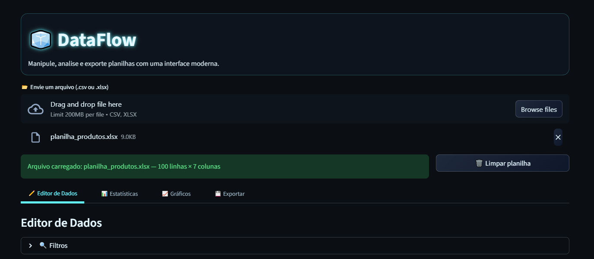

# 📊 DataFlow

[](https://www.python.org/)  
[](https://streamlit.io/)  
[](LICENSE)  

Manipule, analise e exporte planilhas com uma interface moderna, responsiva e fácil de usar.  
O **DataFlow** é um aplicativo construído em [Streamlit](https://streamlit.io/) que permite trabalhar com arquivos CSV/XLSX de forma interativa.  

---

## 🚀 Deploy Público  

👉 [Acesse aqui no Streamlit Cloud](https://dataflow.streamlit.app)

---

## ✨ Funcionalidades  

- Upload de arquivos **CSV** ou **Excel (XLSX)**
- Editor de dados interativo (adicionar, editar, remover linhas e colunas)
- Limpeza de dados: preenchimento de valores ausentes, renomeação, exclusão de linhas/colunas
- Filtros simples (numéricos e textuais)
- Estatísticas dinâmicas com métricas resumidas
- Gráficos interativos (linha, barra, dispersão, histograma)
- Exportação em **CSV, XLSX e PDF** (com gráficos incluídos)

---

## 🖼️ Preview  



---

## 🛠️ Instalação local  

Clone o repositório e instale as dependências:

```bash
git clone https://github.com/AurusDev/DataFlow.git
cd DataFlow
pip install -r requirements.txt

---

## 📌 Recursos adicionais

- 📖 [Guia de Contribuição](CONTRIBUTING.md)  
- 🛣️ [Roadmap do Projeto](ROADMAP.md)

